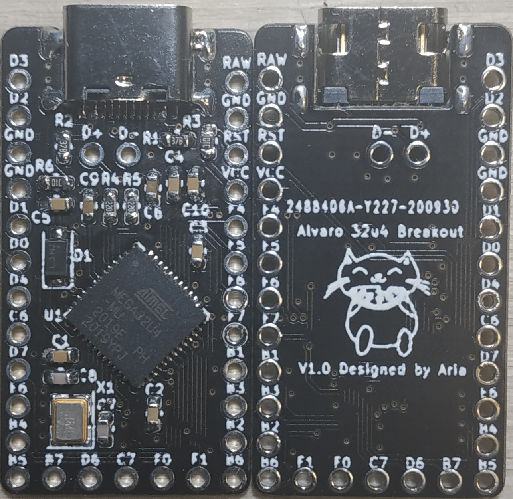
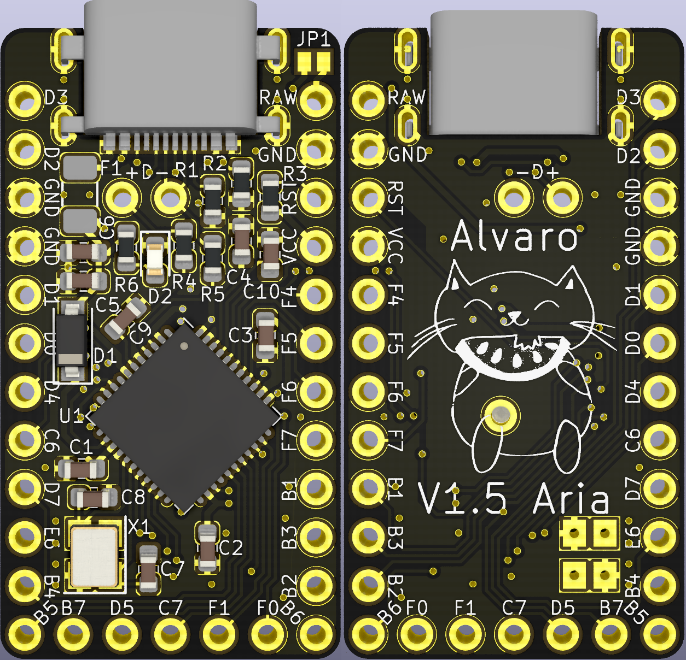

# Alvaro
 Pro Micro-compatible 32u4 Breakout Board

## Disclaimer
This board is a heavily-modified [Goldfish Rev. C](https://github.com/staticintlucas/Goldfish). While the schematic, basic layout, pinout (of course) etc is essentially the same, it uses 0603 components instead of 0402 and has some other changes.

## Key Features
* Mid-mount USB-C connector using a low-profile USB C 2.0 connector.
* Pin-compatible with the original Pro Micro.
* 5 extra pins on the bottom like the Elite-C and Goldfish.
* Exposed USB data lines on 2.54mm grid.
* Easier to solder than the Goldfish.
* Has fuse unlike Goldfish.
* On-board power LED.

## Changelog
* 27/09/2020: Initial commit.
* 29/09/2020: Switched D1 size from SOD323 to SOD123.
* 13/10/2020: Updated to V1.1 - added F1 1206 500mA polyfuse.
* 17/10/2020: Updated to V1.2 - moved location of parts closer to center.
* 31/10/2020: Updated to V1.3 - added 0603 power indicator LED, changed R6 from 10k to 1k LED resistor.