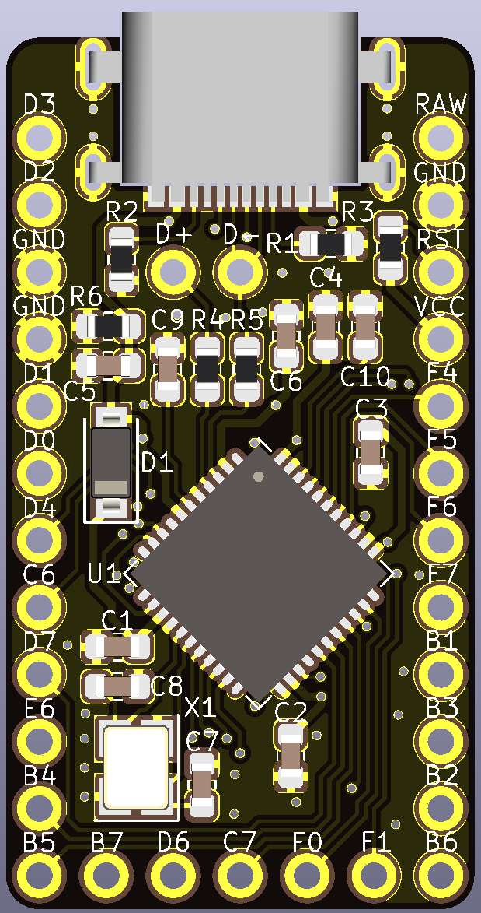

# Alvaro
 Pro Micro-compatible 32u4 Breakout Board

## Disclaimer
This board is a heavily-modified [Goldfish Rev. C](https://github.com/staticintlucas/Goldfish). While the basic layout, pinout (of course) etc is the same, it uses 0603 components instead of 0402 and has some other changes, to the point where I feel justified calling it an entirely new design.

## Key Features
* Mid-mount USB-C connector, using a lower-profile USB C 2.0 part than the Goldfish, as the Pro Micro doesn't require anything more than the USB 2.0 standard to function.
* Pin-compatible with the original Pro Micro.
* 5 extra pins on the bottom like the Elite-C and Goldfish.
* Exposed USB data lines.
* Easier to solder than the Goldfish and more accessible than the Elite-C.